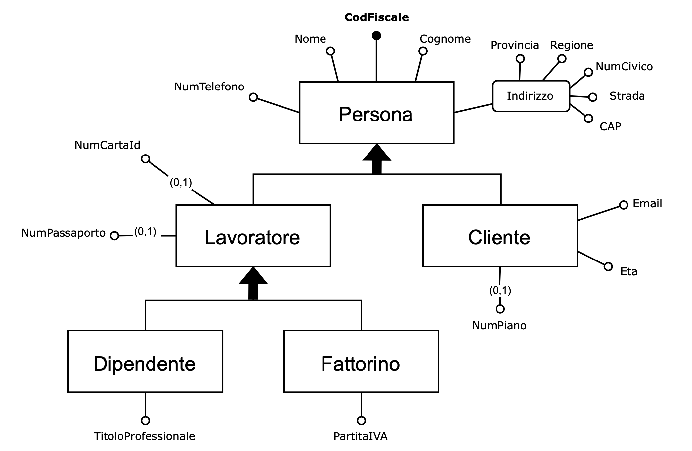
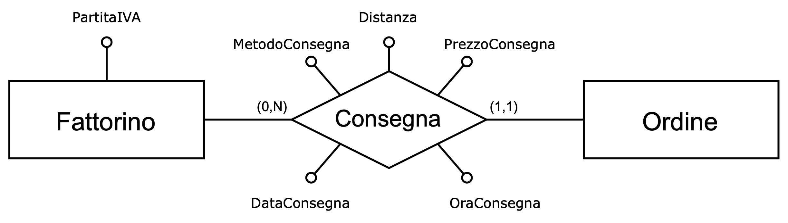
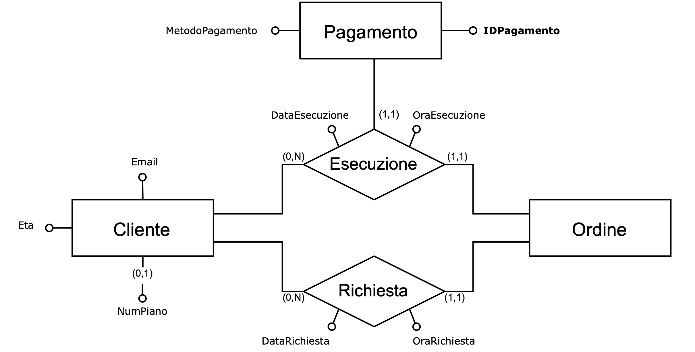
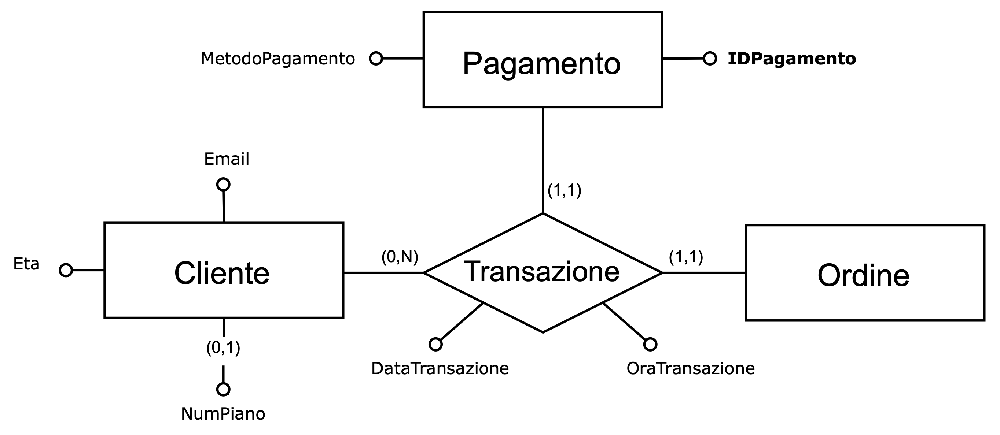
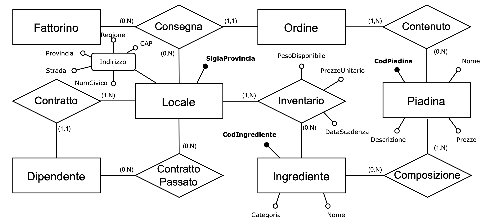
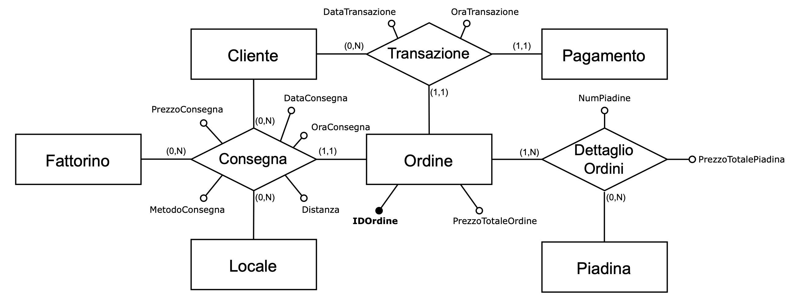
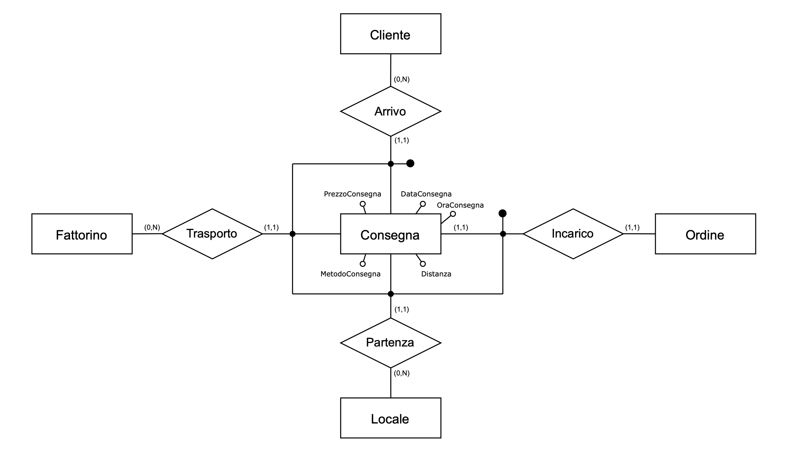
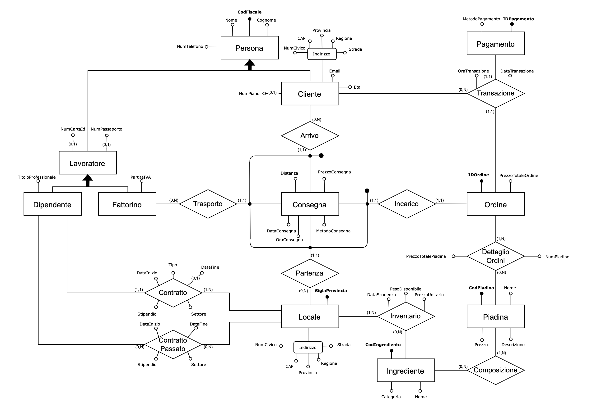
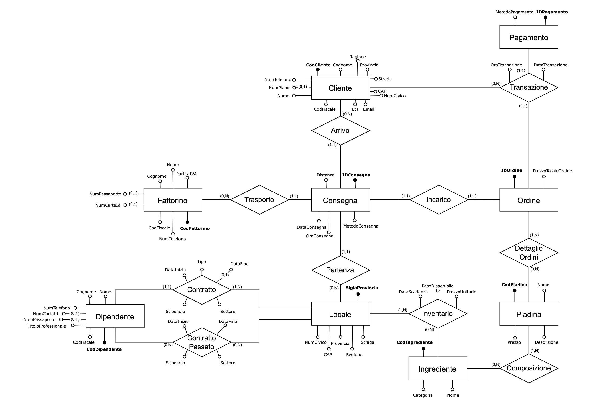

# 🍽️ Takeaway Database Management System
> **Project:** takeaway-db-system  
> **Purpose:** Design and implementation of a database system for managing a piadina (Italian flatbread sandwich) takeaway chain.  
> **Language:** SQL / MySQL

---

## 📚 Table of Contents
1. [Conceptual Design](#-conceptual-design)
  - 1.1 [Sample Owner Request](#-sample-owner-request)
  - 1.2 [Requirements Analysis](#-requirements-analysis)
  - 1.3 [Requirements Gathering](#-requirements-gathering)
    - 1.3.1 [Data Requirements](#-data-requirements)
    - 1.3.2[Operation Requirements](#-operation-requirements)
  - 1.4 [Conceptual Data Representation](#-conceptual-data-representation)
  - 1.5 [Documentation of the Conceptual Data Schema](#-documentation-of-the-conceptual-data-schema)
2. [Logical Design](#-logical-design)
  - 2.1 [E-R Schema Restructuring](#-e-r-schema-restructuring)
    - 2.1.1 [Redundancy Analysis](#-redundancy-analysis)
    - 2.1.2 [Removal of Generalizations](#-removal-of-generalizations)
    - 2.1.3 [Removal of Multivalued Attributes](#-removal-of-multivalued-attributes)
    - 2.1.4 [Selection of Primary Identifiers](#-selection-of-primary-identifiers)
    - 2.1.5 [Restructured Schema](#-restructured-schema)
  - 2.2 [Translation to the Relational Model](#translation-to-the-relational-model)
    - 2.2.1 [Logical Schema](#logical-schema)
3. [MySQL Implementation](#mysql-implementation)
  - 3.1 [Procedures](#procedures)
    - 3.1.1 [RemoveExpiredIngredients](#removeexpiredingredients)
    - 3.1.2 [ListShopsWithLimitedIngredient](#listshopswithlimitedingredient)
    - 3.1.3 [ChainMenu](#chainmenu)
    - 3.1.4 [PrintOrderReceipt](#printorderreceipt)
    - 3.1.5 [DailyDeliveryReport](#dailydeliveryreport)
    - 3.1.6 [CreateCustomerOrderHistory](#createcustomerorderhistory)
    - 3.1.7 [FindBest](#findbest)
  - [Functions](#functions)
    - 3.1.8 [MonthlySalesTotal](#monthlysalestotal)
    - 3.1.9 [CountPiadinePerOrder](#countpiadineperorder)

---

## 1. CONCEPTUAL DESIGN

### 1.1 Sample Owner Request
A chain of takeaway sandwich _shops_, with _locations_ in the main cities of Italy, requires a well-organized database to manage information about customers, orders, workers, inventory, sandwiches and _branches_.

For each `customer`, personal information is recorded, including **first name**, **last name**, **age**, **email**, **tax code**, **phone number**, **_address_**, and, if applicable, the **_floor_**.

The staff at each _point of sale_ is divided into different categories (such as cleaning staff, sandwich makers, and packaging staff). For each `employee`, the **first name**, **last name**, **phone number**, and **_details of documents required for hiring_** are recorded. Additional useful information is also stored, including **job title**, **type of contract** (fixed-term or permanent), **_salary_**, **department**, **_contract period_** (for fixed-term contracts), and **previous employment**.

For _those who work independently_, the situation is different: they have a **VAT number** and are not associated with a specific _store_.

Each worker, whether employed or self-employed, can also be a customer.

The chain has only one _shop_ per city. Each `store` is registered through its **_address_** and has its own staff, and an `inventory` consisting of the ingredients required to prepare sandwiches. Each `ingredient` is recorded with a **unique code**, **name**, **category** (e.g., meat, fish, vegetables), **_unit price_**, **expiration date**, and **_available quantity_**.

Each `sandwich` has a **unique code**, a **name**, a **description**, and a **_price_**. Each `order`, placed by a customer, is delivered by a `rider` from a specific _store_. Orders are recorded with a **unique code** and **_total order price_**. The delivery _price_ varies depending on the delivery type (for “standard” the price doesn’t change, while for “express” it increases by €3) and on the _distance_ (each kilometer adds €0.20).  

Each order is linked to a `payment` transaction, recorded with a **payment code** and **method**. For each stage of the order (request, delivery, and payment), the **date** and **time** are recorded.

---

### 1.2 Requirements Analysis
This text presents a number of ambiguities and inaccuracies. At this stage, it is important to:

🔹 **Avoid overly generic terms**, which make a concept unclear, and replace them with more meaningful ones or define them clearly:
  - `Address` → address including region, province, street (street or square), postal code, and street number  
  - `Floor` → floor number  
  - `Details of documents required for hiring` → tax code and ID card number, or alternatively passport number  
  - `Contract period` → employment start and end dates  
  - `Available quantity` → available weight  
  - `Distance` → distance between the delivery address (customer residence) and the store from which the order is sent  

🔹 **Simplify convoluted sentences** that make the text difficult to understand:
  - `Those who work independently` → freelance workers

🔹 **Identify synonyms and homonyms** to clarify ambiguities:
  - `Location`, `shop`, `point of sale` and `branch` → store

🔹 **Make references between terms explicit:**
  - `Freelance workers` → riders

🔹 **Indicate the unit of measurement** for all quantities:
  - `Unit price` → euro per kg 
  - `Available weight` → kilograms  
  - `Distance` → kilometers  
  - `Price` and `total order price` → euro

To clarify and understand the terms used, a glossary of terms is presented below.

---

### 📖 Glossary of Terms

> **Purpose:** Clarify the key terms used throughout the conceptual and logical design.

| **Term** | **Description** | **Synonyms** | **Related terms** |
|-----------|-----------------|---------------|--------------------|
| `Distance` | Distance between the store and the delivery address (customer's residence). | — | `Order` |
| `Documents for hiring` | Tax code and an identity document, i.e., ID card or passport. | — | `Worker`, `Store` |
| `Riders` | Workers of the chain, with a VAT number, who deliver the orders. | `Self-employed workers` | `Staff` |
| `Address` | Address of the customer or a store, including region, province, postal code, street/square, and street number. | — | `Customer`, `Order`, `Store` |
| `Workers` | Staff employed in each store, i.e., employees. Also includes self-employed ones. | `Staff`, `Employees` | `Store`, `Worker` |
| `Store` | A store of the chain. | `Location`, `Shop`, `Point of sale` | `Worker`, `Order` |
| `Contract period` | Start and end date of a work contract. | — | `Staff` |
| `Floor` | Number of the floor of an apartment. | — | `Customer` |
| `Available quantity` | Available weight. | — | `Ingredient` |
| `Street` | General term for indicating a street or square in an address. | — | `Address` |

---

### 1.3 Requirements Gathering

#### 1.3.1 On Data
Following the request and the glossary, we proceed with requirements gathering — that is, identifying the characteristics that our database must possess.  
After reformulating certain terms and removing ambiguities, the text is broken down into groups of related sentences.

---

#### 🧑‍💼 Sentences Related to Workers
Each `Worker` is recorded with personal information such as **first name**, **last name**, **phone number**, **tax code**, and **ID card number** (or passport number).  
For `Staff`, additional information is stored, including **professional title**, **type of contract** (fixed-term or permanent), **salary**, **department**, **employment start and end dates** (for fixed-term contracts), and **previous work experience**.
`Riders` are self-employed workers with a VAT number and are not associated with a specific `Store`.  
Each worker, whether an employee or a rider, can also be a `Customer`.

---

#### 🏪 Sentences Related to Stores
The chain operates **one** `Store` **per city**.  
Each store is recorded with its **address**, which includes region, province, postal code, street, and street number.  
Every store mantains its own `Staff` and `Inventory`, independent of other locations.

---

#### 🧂 Sentences Related to Ingredients
The `Inventory` includes all `Ingredients` used to prepare sandwiches.  
Each ingredient is identified with a **unique code**, **name**, **category** (e.g., meat, fish, vegetables), **unit price** (in euros per kg), **expiration date**, and **available weight** (in kg).

---

#### 🥪 Sentences Related to Sandwiches
Each `Sandwich` is defined by a **unique code**, **name**, **description**, and **price**.

---

#### 🧾 Sentences Related to Orders
Each `Order`, placed by a `Customer`, is delivered by a `Rider` from a specific `Store`.  
Orders are recorded with a **unique code** and the **total order price**.  
The delivery fee depends on **delivery type** and **distance** between the customer and the store.  
Each stage of the order — request, delivery, and payment — is recorded with **date** and **time**.

---

#### 💳 Sentences Related to Transactions
Each `Transaction` is recorded with a **payment code** and **payment method**, and is associated with a specific `Order`.

---

#### 1.3.1 On Operations
Alongside the data specifications, the operations to be performed on the data and their average frequencies are collected.

| **Operation** | **Description** | **Average Frequency** |
|----------------|------------------|------------------------|
| **1** | Remove expired ingredients from inventory | Once a day |
| **2** | Check available weight of an ingredient against a limit | Several times a day |
| **3** | Print the chain’s menu (list of available sandwiches) | Several times a day |
| **4** | Print the receipt of an order | 20 times a day |
| **5** | Print a daily delivery report | Once a day |
| **6** | Create a historical record of orders for a specific customer | 10 times a day |
| **7** | Select the 3 best among riders, stores, customers, and orders | Once a month |
| **8** | Calculate total sales for a specific month and year | 5 times a month |
| **9** | Calculate the number of sandwiches in an order | 20 times a day |

---

### 1.4 Conceptual Data Representation
Following the analysis and gathering of requirements, we proceed to the **conceptual representation of data**, which leads to the creation of the **conceptual schema**.
We first identify the most relevant concepts in our context: **Customer**, **Employee**, **Riders**, **Store**, **Ingredient**, **Sandwich**, **Order**, and **Payment**. These form the **skeleton of the system**.

- An `Order` consists of several activities: the `Customer`’s _request_ for a certain number of `Sandwiches`, _delivery_ from a `Store` through a `Rider`, and the successful _execution_ of the `Payment`.
- Both Rider and Employee are `Workers`; however, an `Employee`, unlike a Rider, has a _contract_ with a specific Store.
- Similarly, a Customer and a Worker can be considered a single `Person`.
- Each Store has its own _inventory_, composed of available `Ingredients` which are *combined* to create Sandwiches — the main _content_ of each Order.

`Objects` are transformed into **entities**, and the _relationships_ among them are represented as **relations** (each term expressed in singular form).

<p align="center">
  
</p>

<details>
<summary>🇬🇧 English Legend</summary>

| Italian Term   | English Translation  |
|----------------|-------------------|
| Cliente        | Customer          |
| Composizione   | Composition       |
| Consegna       | Delivery          |
| Contenuto      | Content           |
| Dipendente     | Employee          |
| Esecuzione     | Execution         |
| Fattorino      | Rider             |
| Impiego        | Contract          |
| Ingrediente    | Ingredient        |
| Inventario     | Inventory         |
| Lavoratore     | Worker            |
| Locale         | Store             |
| Ordine         | Order             |
| Pagamento      | Payment           |
| Piadina        | Sandwhich         |
| Persona        | Person            |
| Richiesta      | Request           |

</details>

We now analyze all entities and their relationships, indicating their attributes.

---

#### Person Entity
The `Person` entity is the parent of both `Worker` and `Customer`; this generalization is **total and overlapping**.
`Worker` is further divided into `Employee` and `Rider`; this generalization is **total and exclusive**.

<p align="center">
  
</p>

<details>
<summary>🇬🇧 English Legend</summary>

| Italian Term          | English Translation            |
|-----------------------|--------------------------------|
| CAP                   | Postal Code / ZIP Code         |
| Cliente               | Customer                       |
| CodFiscale            | Tax Code                       |
| Cognome               | Last Name / Surname            |
| Dipendente            | Employee                       |
| Email                 | Email                          |
| Eta                   | Age                            |
| Fattorino             | Rider                          |
| Indirizzo             | Address                        |
| Lavoratore            | Worker                         |
| Nome                  | First Name                     |
| NumCartaId            | ID Card Number                 |
| NumCivico             | Street Number                  |
| NumPassaporto         | Passport Number                |
| NumPiano              | Floor Number                   |
| NumTelefono           | Phone Number                   |
| PartitaIVA            | VAT Number                     |
| Persona               | Person                         |
| Regione               | Region                         |
| Provincia             | Province                       |
| Strada                | Street                         |
| TitoloProfessionale   | Job Title / Professional Title |

</details>

---

#### Relationship between Employee & Store
Each `Employee` has only one `Contract` with a `Store`, represented as a **one-to-many relationship**.
To record previous employment, we use a **many-to-many relationship** called `PastContract`.
The two relationships share most attributes, but the first includes a **Type** attribute (fixed-term or permanent), which determines whether an **EndDate** is required.

<p align="center">
  
</p>

<details>
<summary>🇬🇧 English Legend</summary>

| Italian Term                  | English Translation           |
|-------------------------------|-------------------------------|
| Contratto                     | Contract                      |
| ContrattoPassato              | Past / Previous Contract      |
| DataFine                      | End Date                      |
| DataInizio                    | Start Date                    |
| DataInizio DataFine           | Start Date / End Date         |
| Dipendente                    | Employee                      |
| Locale                        | Location / Store              |
| Stipendio Settore             | Salary / Sector               |
| Tipo                          | Type                          |
| TitoloProfessionale Contratto | Job Title (Contract)          |

</details>

---

#### Relationship between Rider & Order
Each `Rider` can deliver multiple orders, but each `Order` is delivered by only one Rider, forming a **one-to-many relationship** called `Delivery` between Order and Rider.

<p align="center">
  
</p>

<details>
<summary>🇬🇧 English Legend</summary>

| Italian Term        | English Translation     |
|---------------------|-------------------------|
| Consegna            | Delivery                |
| DataConsegna        | Delivery Date           |
| Distanza            | Distance                |
| Fattorino           | Delivery Person         |
| MetodoConsegna      | Delivery Method         |
| MetodoPagamento     | Payment Method          |
| OraConsegna         | Delivery Time           |
| Ordine              | Order                   |
| PartitaIVA          | VAT Number              |
| PrezzoConsegna      | Delivery Price          |

</details>

---

#### Customer Entity
Each `Customer` can place multiple `Orders` and perform multiple `Payments`; however, each order is requested and paid for by one and only one Customer.

<p align="center">
  
</p>

<details>
<summary>🇬🇧 English Legend</summary>

| Italian Term        | English Translation     |
|---------------------|-------------------------|
| Cliente             | Customer                |
| DataEsecuzione      | Execution Date          |
| DataRichiesta       | Request Date            |
| Email               | Email                   |
| Esecuzione          | Execution               |
| Eta                 | Age                     |
| Fattorino           | Delivery Person         |
| IDPagamento         | Payment ID              |
| MetodoPagamento     | Payment Method          |
| NumPiano            | Floor Number            |
| OraEsecuzione       | Execution Time          |
| OraRichiesta        | Request Time            |
| Ordine              | Order                   |
| Pagamento           | Payment                 |
| Richiesta           | Request                 |

</details>

---

#### Transaction Entity
Since `Execution` and `Request` alone don't ensure a connection between `Order` and `Payment` - because a customer could make a payment without an order, or an order could exist without payment - we introduce a **ternary relationship** `Transaction` among `Customer`, `Payment`, and `Order`.
This resolves the ambiguity and ensures a unified and centralized interaction: the request and the payment occur simultaneously.

<p align="center">
  
</p>

<details>
<summary>🇬🇧 English Legend</summary>

| Italian Term        | English Translation     |
|---------------------|-------------------------|
| Cliente             | Customer                |
| DataEsecuzione      | Execution Date          |
| DataRichiesta       | Request Date            |
| Email               | Email                   |
| Esecuzione          | Execution               |
| Eta                 | Age                     |
| Fattorino           | Delivery Person         |
| IDPagamento         | Payment ID              |
| MetodoPagamento     | Payment Method          |
| NumPiano            | Floor Number            |
| OraEsecuzione       | Execution Time          |
| OraRichiesta        | Request Time            |
| Ordine              | Order                   |
| Pagamento           | Payment                 |
| Richiesta           | Request                 |

</details>

---

#### Store Entity
Each `Store` is uniquely identified by the **province code** (e.g., FI for Florence), because there is only one store per city.
The `Inventory` relationship between `Store` and `Ingredient` records the **UnitPrice**, which is _not stored in Ingredient entity_ because it varies by store location.

<p align="center">
  
</p>

<details>
<summary>🇬🇧 English Legend</summary>

| Italian Term         | English Translation           |
|----------------------|-------------------------------|
| CAP                  | Postal Code / ZIP Code        |
| Categoria            | Category                      |
| CodIngrediente       | Ingredient Code               |
| CodPiadina           | Sandwich Code                 |
| Composizione         | Composition                   |
| Consegna             | Delivery                      |
| Contratto            | Contract                      |
| Contenuto            | Content                       |
| DataScadenza         | Expiration Date               |
| Descrizione          | Description                   |
| Dipendente           | Employee                      |
| Fattorino            | Rider                         |
| Ingrediente          | Ingredient                    |
| Indirizzo            | Address                       |
| Inventario           | Inventory                     |
| Locale               | Store                         |
| Nome                 | Name                          |
| NumCivico            | Street Number                 |
| Passato              | Past / Previous               |
| PesoDisponibile      | Available Weight              |
| Piadina              | Sandwich                      |
| Prezzo               | Price                         |
| PrezzoUnitario       | Unit Price                    |
| Provincia            | Province                      |
| Regione              | Region                        |
| SiglaProvincia       | Province Abbreviation         |
| Strada               | Street                        |

</details>

---

#### Order Entity
The `Order` entity includes **TotalOrderPrice**, equal to the sum of **DeliveryPrice** and the total price of all `Sandwiches` in the order (**TotalSandwichPrice** for each type).
To track individual sandwiches, the relationship between `Order` and `Sandwich` is represented explicitly as `OrderDetails`, recording **NumSandwiches** and **TotalSandwichPrice**.
**Distance** can be derived from the difference between the Customer’s and Store’s addresses; therefore, `Delivery` is associated with the `Customer` as well.

<p align="center">
  
</p>

<details>
<summary>🇬🇧 English Legend</summary>

| Italian Term               | English Translation           |
|----------------------------|-------------------------------|
| Cliente                    | Customer                      |
| Consegna                   | Delivery                      |
| DataConsegna               | Delivery Date                 |
| DataTransazione            | Transaction Date              |
| Dettaglio                  | Detail                        |
| Distanza                   | Distance                       |
| Fattorino                  | Delivery Person               |
| IDOrdine                   | Order ID                      |
| Locale                     | Location / Store              |
| MetodoConsegna             | Delivery Method               |
| NumPiadine                 | Number of Sandwiches          |
| Ordine                     | Order                         |
| Ordini                     | Orders                        |
| OraConsegna                | Delivery Time                 |
| OraTransazione             | Transaction Time              |
| Pagamento                  | Payment                       |
| Piadina                    | Sandwich                      |
| PrezzoConsegna             | Delivery Price                |
| PrezzoTotalePiadina        | Sandwich Total Price          |
| PrezzoTotaleOrdine         | Total Order Price             |

</details>

At this point, `Delivery` becomes an association involving **four entities** with several attributes, so it is more convenient to treat it as a **separate entity**, uniquely identified by the combination of `Customer`, `Rider`, `Order`, and `Store`.

<p align="center">
  
</p>

<details>
<summary>🇬🇧 English Legend</summary>
| Italian Term       | English Translation           |
|--------------------|-------------------------------|
| Arrivo             | Arrival                       |
| Cliente            | Customer                      |
| Consegna           | Delivery                      |
| DataConsegna       | Delivery Date                 |
| Distanza           | Distance                      |
| Fattorino          | Delivery Person               |
| Incarico           | Assigment                     |
| Locale             | Store                         |
| MetodoConsegna     | Delivery Method               |
| OraConsegna        | Delivery Time                 |
| Ordine             | Order                         |
| Partenza           | Departure                     |
| PrezzoConsegna     | Delivery Price                |

</details>

---

#### Final Schema

The final conceptual schema is obtained by integrating all partial schemas generated above.

<p align="center">
  
</p>

<details>
<summary>🇬🇧 English Legend</summary>

| Italian Term               | English Translation              |
|----------------------------|----------------------------------|
| Arrivo                     | Arrival                          |
| CAP                        | Postal Code / ZIP Code           |
| Categoria                  | Category                         |
| Cliente                    | Customer                         |
| CodFiscale                 | Tax Code / SSN                   |
| CodIngrediente             | Ingredient Code                  |
| CodPiadina                 | Sandwich Code                    |
| Composizione               | Composition                      |
| Consegna                   | Delivery                         |
| Contratto                  | Contract                         |
| ContrattoPassato           | Past Contract                    |
| DataConsegna               | Delivery Date                    |
| DataEsecuzione             | Execution Date                   |
| DataFine                   | End Date                         |
| DataInizio                 | Start Date                       |
| DataScadenza               | Expiration Date                  |
| DataTransazione            | Transaction Date                 |
| DettaglioOrdini            | Order Details                    |
| Descrizione                | Description                      |
| Dipendente                 | Employee                         |
| Distanza                   | Distance                         |
| Email                      | Email                            |
| Eta                        | Age                              |
| Fattorino                  | Delivery Person                  |
| IDOrdine                   | Order ID                         |
| IDPagamento                | Payment ID                       |
| Incarico                   | Assignment                       |
| Ingrediente                | Ingredient                       |
| Inventario                 | Inventory                        |
| Indirizzo                  | Address                          |
| Lavoratore                 | Worker                           |
| Locale                     | Store                            |
| MetodoConsegna             | Delivery Method                  |
| MetodoPagamento            | Payment Method                   |
| NumCartaId                 | ID Card Number                   |
| NumCivico                  | Street Number                    |
| NumPiano                   | Floor Number                     |
| NumPiadine                 | Number of Sandwiches             |
| NumTelefono                | Phone Number                     |
| OraConsegna                | Delivery Time                    |
| OraTransazione             | Transaction Time                 |
| Ordine                     | Order                            |
| Pagamento                  | Payment                          |
| Partenza                   | Departure                        |
| PartitaIVA                 | VAT Number                       |
| Piadina                    | Sandwich                         |
| PesoDisponibile            | Available Weight                 |
| Prezzo                     | Price                            |
| PrezzoConsegna             | Delivery Price                   |
| PrezzoTotaleOrdine         | Total Order Price                |
| PrezzoTotalePiadina        | Sandwich Total Price             |
| PrezzoUnitario             | Unit Price                       |
| Regione                    | Region                           |
| SiglaProvincia             | Province Abbreviation            |
| Settore                    | Sector                           |
| Stipendio                  | Salary                           |
| Strada                     | Street                           |
| Tipo                       | Type                             |
| Transazione                | Transaction                      |

</details>

---

### 1.5 Documentation of the Conceptual Data Schema

### UML Entities

|**Entity**|**Description**|**Attributes**|**Identifiers**|
|-----------|---------------|---------------|----------------|
|**Person**|Generic individual|Name, Surname, TaxCode, PhoneNumber, Address (Region, Province, Street, PostalCode, StreetNumber)|TaxCode|
|**Customer**|Person who places an order|Email, Age, FloorNumber|TaxCode|
|**Worker**|Person who works for or within the chain|IDCardNumber, PassportNumber|TaxCode|
|**Rider**|Worker who delivers orders|VATNumber|TaxCode|
|**Employee**|Worker who works or has worked for a specific store|ProfessionalTitle|TaxCode|
|**Store**|Structure belonging to the chain|ProvinceCode, Address (Region, Province, Street, PostalCode, StreetNumber)|ProvinceCode|
|**Ingredient**|Raw material used to prepare piadinas|IngredientCode, Category, Name|IngredientCode|
|**Sandwich**|Main product sold|SandwichCode, Name, Price, Description|SandwichCode|
|**Order**|Order containing one or more piadinas for a customer|OrderID, TotalOrderPrice|OrderID|
|**Payment**|Payment of the order by the customer|PaymentID, PaymentMethod|PaymentID|
|**Delivery**|Delivery of an order, carried out by a rider from a store to a customer|DeliveryMethod, DeliveryPrice, DeliveryDate, DeliveryTime, Distance|Rider, Customer, Order, Store|

### UML Constraint Rules

|**ID**|**Rule Description**|
|------|--------------------|
|**CR1**|An order can be delivered if and only if the payment has been made.|
|**CR2**|For each contract, if an EndDate exists, the StartDate must precede it.|
|**CR3**|Every permanent contract must not have an EndDate.|
|**CR4**|Every fixed-term contract must have an EndDate.|
|**CR5**|Each worker must possess either an IDCardNumber or a PassportNumber.|
|**CR6**|Each customer can place orders only from the store in their province.|

### UML Relationships

|**Relationship**|**Description**|**Related Entities**|**Attributes**|
|----------------|----------------|--------------------|---------------|
|**Contract**|Specifies the details of a contract between a store and an employee.|Employee - Store|StartDate, EndDate, Sector, Salary, Type|
|**Past Contract**|Specifies completed employment contracts.|Employee - Contract|StartDate, EndDate, Sector, Salary|
|**Inventory**|Represents the food stock of a store.|Store - Ingredient|AvailableWeight, UnitPrice, ExpirationDate|
|**Composition**|Specifies the ingredients of a sandwich.|Sandwich - Ingredient|-|
|**Order Details**|Lists the details of the sandwiches in an order.|Order - Sandwich|NumberOfSandwiches, TotalSandwichPrice|
|**Transaction**|Associates an order with a payment from a specific customer.|Order - Payment - Customer|TransactionDate, TransactionTime|
|**Departure**|Indicates the store from which the delivery starts.|Delivery - Store|-|
|**Arrival**|Associates the customer with the delivery.|Delivery - Customer|-|
|**Transport**|Specifies the rider assigned to the delivery.|Delivery - Rider|-|
|**Assignment**|Associates an order with a delivery.|Delivery - Order|-|

---

## 2. LOGICAL DESIGN

### 2.1 E-R Schema Restructuring

#### 2.1.1 Redundancy Analysis
The E-R schema contains several redundant attributes:

- **DeliveryPrice** in `Delivery`, which can be derived, within the same entity, from the attributes _DeliveryMethod_ and _Distance_.

  ```text
  DeliveryPrice_Distance = Distance × 0.2
  DeliveryPrice_Method = (DeliveryMethod = 'Express') ? 3 : 0
  DeliveryPrice = DeliveryPrice_Distance + DeliveryPrice_Method
  ```

- **TotalSandwichTypePrice** in `OrderDetails`, which can be obtained, through `OrderDetails` and `Sandwich`, by multiplying the price of the specific type of sandwich (_Price_) by the number of sandwiches of that type (_NumSandwiches_).

  ```text
  TotalSandwichTypePrice = Price × NumSandwiches
  ```

- **TotalOrderPrice** in `Order`, which is derived, through `OrderDetails`, `Sandwich`, and `Delivery`, as the sum of all the sandwiches ordered (or equivalently, the sum of _TotalSandwichTypePrice_ for each different type, i.e., for each _SandwichCode_ present in the order) plus the _DeliveryPrice_.

  ```text
  for (type ∈ SandwichCode)
    TotalSandwichesPrice = TotalSandwichesPrice + TotalSandwichTypePrice
  TotalOrderPrice = TotalSandwichesPrice + DeliveryPrice
  ```
Only operations 4, 5, 6, and 8, handle the _TotalOrderPrice_, which also involves the other redundant attributes. For this reason, the following load data assumptions are considered.

---

### Volume and Operation Tables

#### Table of Volumes

| **Concept** | **Type** | **Volume** |
|--------------|-----------|-------------|
| Person | E | 10,000 |
| Customer | E | 9,500 |
| Worker | E | 500 |
| Rider | E | 250 |
| Employee | E | 250 |
| Store | E | 25 |
| Ingredient | E | 100 |
| Sandwich | E | 15 |
| Order | E | 20,000 |
| Payment | E | 20,000 |
| Delivery | E | 20,000 |
| Contract | R | 250 |
| Past Contract | R | 200 |
| Inventory | R | 1,500 |
| Composition | R | 1,000 |
| OrderDetails | R | 40,000 |
| Transaction | R | 20,000 |
| Departure | R | 20,000 |
| Arrival | R | 20,000 |
| Transport | R | 20,000 |
| Assignment | R | 20,000 |

---

#### Table of Operations

| **Operation** | **Frequency** |
|----------------|----------------|
| Op.4 | 20/day |
| Op.5 | 1/day |
| Op.6 | 10/day |
| Op.8 | 5/month |

---

### Analysis of DeliveryPrice
Assuming each of the 25 store has performed an average of 800 deliveries, there are 20,000 total deliveries for the chain. 
Storing _DeliveryPrice_ requires 20,000 bytes (20KB) of additional memory. 

Whether or not the data is redundant, obtaining _DeliveryPrice_ requires a single read access to `Order`, `Assignment`, and `Delivery`. However, in the absence of the redundant data, the calculation requires three distinct operations (a product, a conditional expression, and a sum), although the total computational complexity remains constant. 

Given that Operation 4 is performed 20 times per day, resulting in 60 read accesses per day, and considering that the number of deliveries may increase significantly over time, it is more efficient to **eliminate this redundant data**.

### Analysis of TotalSandwichTypePrice
This attribute can be derived, for each different type of sandwich (i.e., for each _SandwichCode_), by multiplying _Price_ by _NumSandwiches_. 
However, this attribute is not essential for calculating _TotalOrderPrice_, which can instead be computed directly by summing the prices of all sandwiches associated with the same _OrderID_. 

Since the same procedure would otherwise be executed for each type of sandwich to determine _TotalSandwichTypePrice_, it is preferable to**eliminate TotalSandwichTypePrice** and consequently also _NumSandwiches_.

---

### Analysis of TotalOrderPrice

#### Case with redundancy
Since the total number of deliveries is 20,000, 20KB of additional memory is required to store the attribute. 
In this case, determining _TotalOrderPrice_ requires only one access to `Order`, resulting in 20 accesses per day.

#### Case without redundancy
In the absence of redundancy, calculating _TotalOrderPrice_ requires accessing several constructs: first `Order`, then `Delivery` (via `Assignment`) to compute _DeliveryPrice_, and finally `Sandwich` (via `OrderDetails`) to determine the prices of all sandwiches associated with the same order.

Given that the volumes of `OrderDetails` and `Delivery` are 40,000 and 20,000 respectively, each delivery includes approximately two sandwiches on average. Therefore, the total daily accesses for Operation 4 amount to:

```text
20 × (1 [Order] + 1 [Assignment] + 1 [Delivery] + 2 [OrderDetails] + 2 [Sandwich]) = 140 read accesses
```

#### Choice
The decision to mantaian or eliminate _TotalOrderPrice_ is not straightforward and is *deferred to the physical design phase*.
However, for the purposes of logical design, the attribute is **mantained**.

---

#### 2.1.2 Removal of Generalizations
There are two generalizations in the E-R schema:
- `Person` → `Worker` and `Customer`
- `Worker` → `Employee` and `Rider`
  
Both generalizations are total, and the parent entities are not directly connected to other entities. Therefore, they can be merged into their respective child entities, adding the parent attributes to the children. 
This results in three separate entities - `Customer`, `Employee` and `Rider` - which participate in different associations.

---

#### 2.1.3 Removal of Multivalued Attributes
Instead of storing the multivalued attribute _Address_ for `Customer` and `Store`, the associated attributes are included directly in the respective entities.

---

#### 2.1.4 Selection of Primary Identifiers
After removing generalizations and creating three separate entities, each is assigned an internal identifier of the form _EntityCode_, while _TaxCode_ is kept as an attribute.
Additionally, instead of using the external identifier for `Delivery` (which includes `Order`, `Customer`, `Rider`, and `Store`), a new internal identifier called _DeliveryID_ is introduced.

---

#### 2.1.5 Restructered Schema

<p align="center">
  
</p>

<details>
<summary>🇬🇧 English Legend</summary>

| **Italian Term**    | **English Translation** |
| ------------------- | ----------------------- |
| Arrivo              | Arrival                 |
| CAP                 | Postal Code             |
| Categoria           | Category                |
| Cliente             | Customer                |
| CodCliente          | Customer Code           |
| CodDipendente       | Employee Code           |
| CodFattorino        | Rider Code              |
| CodFiscale          | Tax Code                |
| CodIngrediente      | Ingredient Code         |
| CodPiadina          | Sandwich Code           |
| Composizione        | Composition             |
| Consegna            | Delivery                |
| Contratto           | Contract                |
| Cognome             | Last Name               |
| DataConsegna        | Delivery Date           |
| DataFine            | End Date                |
| DataInizio          | Start Date              |
| DataScadenza        | Expiration Date         |
| DataTransazione     | Transaction Date        |
| DettaglioOrdini     | Order Details           |
| Dipendente          | Employee                |
| Descrizione         | Description             |
| Distanza            | Distance                |
| Email               | Email                   |
| Eta                 | Age                     |
| Fattorino           | Rider                   |
| IDConsegna          | Delivery ID             |
| IDOrdine            | Order ID                |
| IDPagamento         | Payment ID              |
| Incarico            | Assignment              |
| Ingrediente         | Ingredient              |
| Inventario          | Inventory               |
| Locale              | Store                   |
| MetodoConsegna      | Delivery Method         |
| MetodoPagamento     | Payment Method          |
| Nome                | First Name              |
| NumCartaId          | ID Card Number          |
| NumCivico           | Street Number           |
| NumPassaporto       | Passport Number         |
| NumPiano            | Floor Number            |
| NumTelefono         | Phone Number            |
| Ordine              | Order                   |
| OraConsegna         | Delivery Time           |
| OraTransazione      | Transaction Time        |
| Pagamento           | Payment                 |
| Partenza            | Departure               |
| PartitaIVA          | VAT Number              |
| PesoDisponibile     | Available Weight        |
| Piadina             | Sandwich                |
| Prezzo              | Price                   |
| PrezzoUnitario      | Unit Price              |
| Provincia           | Province                |
| Regione             | Region                  |
| Settore             | Department / Sector     |
| SiglaProvincia      | Province Code           |
| Stipendio           | Salary                  |
| Strada              | Street                  |
| Tipo                | Type                    |
| TitoloProfessionale | Professional Title      |
| Transazione         | Transaction             |
| Trasporto           | Transport               |

</details>

---

### 2.2 Translation to the Relational Model

#### 2.2.1 Logical Schema
- **Employee** (EmployeeCode, Name, Surname, TaxCode, PhoneNumber, IDCardNumber*, PassportNumber*, ProfessionalTitle, ContractType, StartDate, EndDate*, Salary, Sector, Store)
- **PastContract** (EmployeeCode, StoreCode, StartDate, EndDate, Salary, Sector)
- **Store** (ProvinceCode, Region, Province, Street, PostalCode, StreetNumber)
- **Inventory** (StoreCode, IngredientCode, AvailableWeight, UnitPrice, ExpirationDate)
- **Ingredient** (IngredientCode, Category, Name)
- **Composition** (IngredientCode, SandwichCode)
- **Sandwich** (SandwichCode, Name, Price, Description)
- **OrderDetails** (OrderID, SandwichCode, NumberOfSandwiches, TotalSandwichPrice)
- **Order** (OrderID, TotalOrderPrice)
- **Payment** (PaymentID, PaymentMethod, TransactionTime, TransactionDate, CustomerCode, OrderID)
- **Customer** (CustomerCode, Name, Surname, TaxCode, Age, Email, PhoneNumber, Region, Province, Street, PostalCode, StreetNumber, FloorNumber*)
- **Rider** (RiderCode, Name, Surname, TaxCode, PhoneNumber, IDCardNumber*, PassportNumber*, VATNumber)
- **Delivery** (DeliveryID, DeliveryMethod, Distance, DeliveryDate, DeliveryTime, OrderID, CustomerCode, RiderCode, StoreCode)

(*) denotes optional attrbutes.

---

#### 2.2.2 Referential Integrity Costraints

- Employee.StoreCode         → Store.ProvinceCode
- PastContract.EmployeeCode  → Employee.EmployeeCode
- PastContract.StoreCode     → Store.ProvinceCode
- Inventory.StoreCode        → Store.ProvinceCode
- Inventory.IngredientCode   → Ingredient.IngredientCode
- Composition.IngredientCode → Ingredient.IngredientCode
- Composition.SandwichCode   → Sandwich.SandwichCode
- OrderDetails.OrderID       → Order.OrderID
- OrderDetails.SandwichCode  → Sandwich.SandwichCode
- Payment.CustomerCode       → Customer.CustomerCode
- Payment.OrderID            → Order.OrderID
- Delivery.OrderID           → Order.OrderID
- Delivery.CustomerCode      → Customer.CustomerCode
- Delivery.RiderCode         → Rider.RiderCode
- Delivery.StoreCode         → Store.ProvinceCode

---

## 3. MYSQL IMPLEMENTATION

For the MySQL implementation, the logical schema and the referential integrity constraints were followed, allowing the definition of all tables in the physical schema (`CreateTables.sql` and `Triggers.sql`).

> Within `Triggers.sql`, a trigger was also included to calculate *TotalOrderPrice*. According to the logical schema, this attribute belongs to the `Order` table; however, in the physical design, its value is initialized to 0 and is computed only after a `Delivery` instance referencing that specific order is created.

The tables were populated with realistic random values (`PopulateTables.sql`), using both the `INSERT INTO` command and the `LOAD DATA` statement (from the files `PopulateStore.csv` and `PopulatePastContract.txt`).

Finally, the nine operations defined during the *Requirements Gathering* phase were implemented as **procedures** (the first seven) and **functions** (the last two).

---

### 3.1 Procedures

#### 3.1.1 RemoveExpiredIngredients
- Deletes expired ingredients from the `Inventory` table (rows where `ExpirationDate < CURDATE()`).
- No input parameters and no return value.
- No error handling required.

---

#### 3.1.2 ListStoresWithLimitedIngredient
- Returns a list of stores where a specific ingredient quantity is below a defined threshold.  
- **Input parameters:**
  - `WeightLimit`: maximum threshold value below which the ingredient is considered insufficient.
  - `IngredientName`: name of the ingredient to check.  
- **Output:** list of stores (identified by `ProvinceCode`) and corresponding quantities (`AvailableWeight`) from the `Inventory` table where `AvailableWeight < WeightLimit`.  
- **Error handling:**
  - `WeightLimit < 0` (a negative value is passed).
  - `IngredientName` not found in the `Ingredient` table.

---

#### 3.1.3 ChainMenu
- Generates a list of all sandwiches sold by the chain, including their names, ingredients, and prices.  
- No input parameters.  
- Returns a list obtained by joining `Composition`, `Sandwich`, and `Ingredient`.  
- No error handling required.

---

#### 3.1.4 PrintOrderReceipt
- Generates a receipt for a specific order, including the order code, the customer’s name and surname, the total price, and payment details (method, date, and time).  
- **Input:** `OrderID`.  
- **Output:** one row obtained by joining `Order`, `Payment`, and `Customer`.  
- **Error handling:**
  - `OrderID` does not match the pattern `^O_[0-9]+$`.
  - `OrderID` matches the pattern but does not exist in the database.
  - `OrderID` exists but the corresponding order has not yet been delivered (thus `TotalOrderPrice` is still 0).

---

#### 3.1.5 DailyDeliveryReport
- Generates a daily report of deliveries, showing the total number of deliveries and total earnings for a specific date.  
- **Input:** `Date`.  
- **Output:** one row containing `COUNT(DeliveryID) AS TotalDeliveries` and `SUM(TotalOrderPrice) AS TotalEarnings` from a join between `Delivery` and `Order`.  
- **Error handling:**
  - `Date > CURDATE()` (future date).
  - No deliveries were made on the specified date.

---

#### 3.1.6 CreateCustomerOrderHistory
- Dynamically creates or updates a view called `CustomerOrderHistory`, containing all orders of a specific customer, sorted from the most recent to the oldest delivery.  
- **Input:** `CustomerCode`.  
- The view is created dynamically through a query stored in `@sql`, which is then executed.  
- **Error handling:**
  - `CustomerCode` does not match the pattern `^CL_[0-9]+$`.
  - `CustomerCode` matches the pattern but does not exist in the database.

---

#### 3.1.7 FindTopPerformers
- Returns statistics on the best-performing entities within the chain — namely, riders, stores, and customers with the highest number of deliveries, and the most frequently ordered sandwiches.  
- No input parameters.  
- Returns four lists, each containing the top three entries per category, sorted in descending order by deliveries (for `Rider`, `Store`, `Customer`) and by total sales (for `Sandwich`).  
- No error handling required.

---

### 3.2 Functions

#### 3.2.1 MonthlySalesTotal
- Calculates the total sales for the chain for a specified month and year.  
- **Input:** `Month`, `Year`.  
- **Output:** a formatted string indicating the total sales for the given month and year.  
- **Error handling:**  
  - `Month < 1 OR Month > 12`.

---

#### 3.2.2 CountSandwichesPerOrder
- Returns the total number of sandwiches in a specified order.  
- **Input:** `OrderID`.  
- **Output:** a formatted string indicating the total number of sandwiches in the order.  
- **Error handling:**
  - `OrderID` does not match the pattern `^O_[0-9]+$`.
  - `OrderID` matches the pattern but does not exist in the database.


