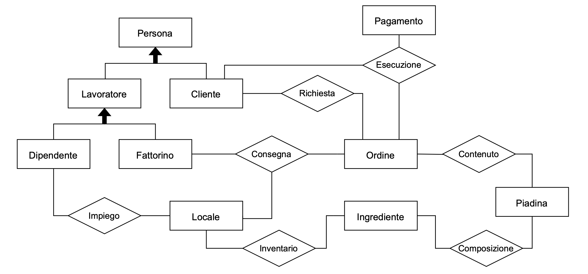
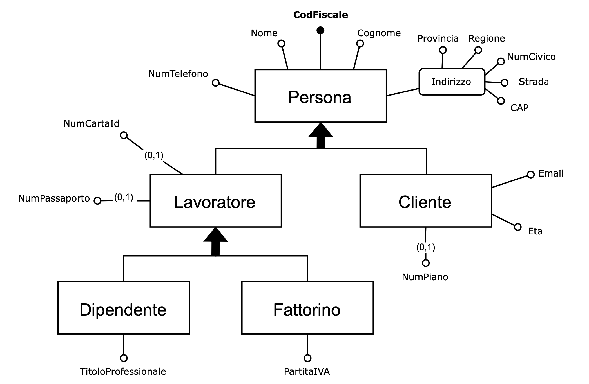
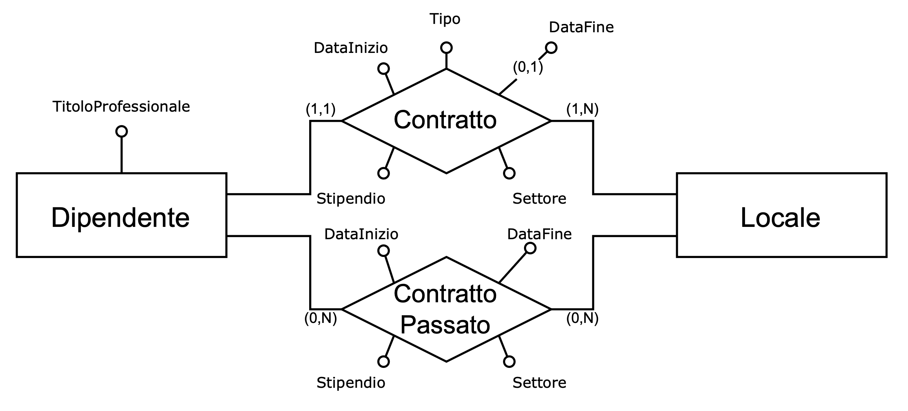
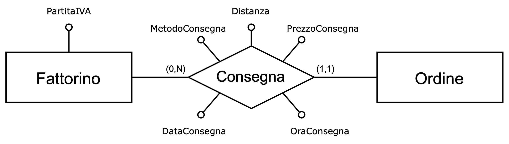
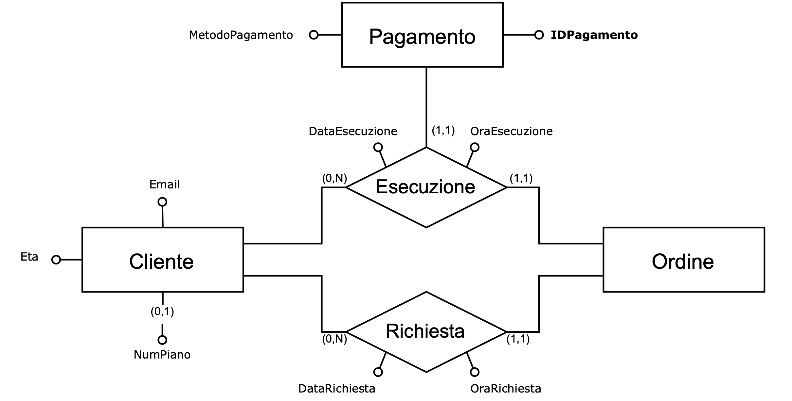
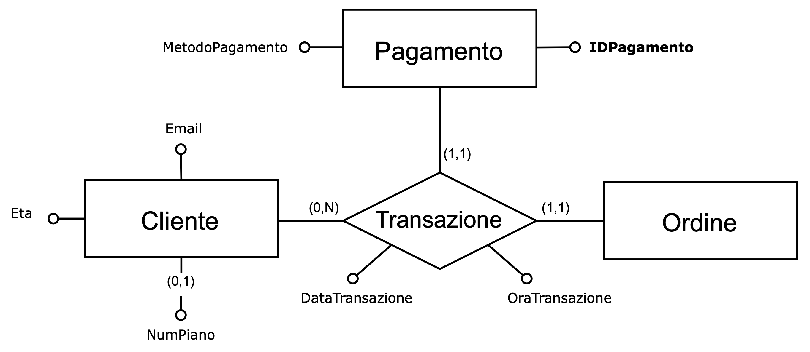
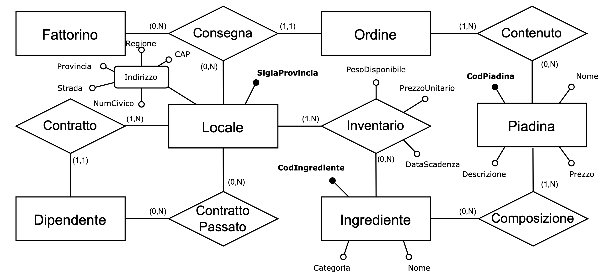
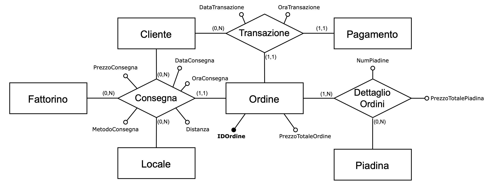
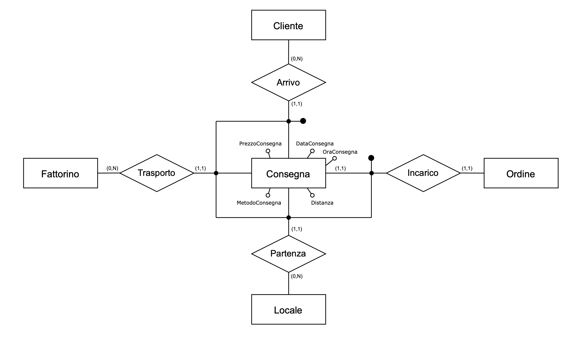
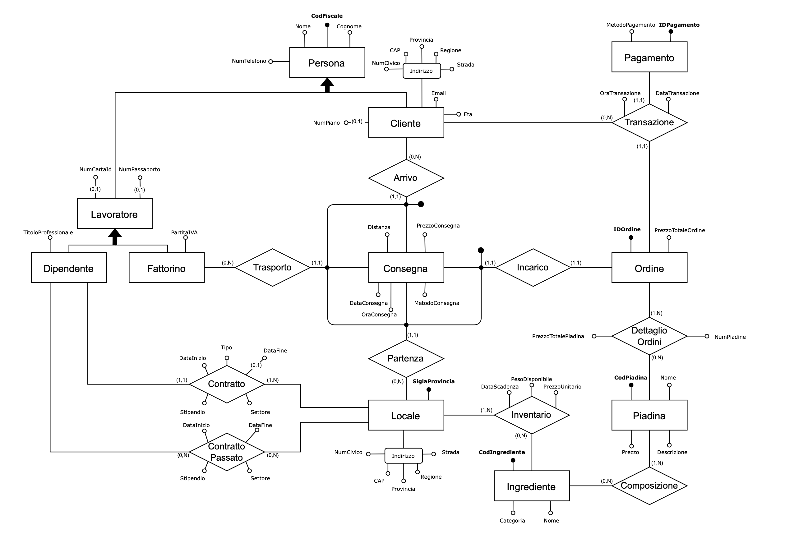

# Detailed Documentation: takeaway-db-system

This document provides an in-depth explanation of the project, which implements a management system for a database of piadines.

---

## 📚 Table of Contents

- [Conceptual Design](#conceptual-design)
  - [Sample Owner Request](#sample-owner-request)
  - [Requirements Analysis](#requirements-analysis)
  - [Requirements Gathering](#requirements-gathering)
    - [Data Requirements](#data-requirements)
    - [Operation Requirements](#operation-requirements)
  - [Conceptual Data Representation](#conceptual-data-representation)
  - [Documentation of the Conceptual Data Schema](#documentation-of-the-conceptual-data-schema)

- [Logical Design](#logical-design)
  - [E-R Schema Restructuring](#e-r-schema-restructuring)
    - [Redundancy Analysis](#redundancy-analysis)
    - [Removal of Generalizations](#removal-of-generalizations)
    - [Removal of Multivalued Attributes](#removal-of-multivalued-attributes)
    - [Selection of Primary Identifiers](#selection-of-primary-identifiers)
    - [Restructured Schema](#restructured-schema)
  - [Translation to the Relational Model](#translation-to-the-relational-model)
    - [Logical Schema](#logical-schema)

- [MySQL Implementation](#mysql-implementation)
  - [Procedures](#procedures)
    - [RemoveExpiredIngredients](#removeexpiredingredients)
    - [ListShopsWithLimitedIngredient](#listshopswithlimitedingredient)
    - [ChainMenu](#chainmenu)
    - [PrintOrderReceipt](#printorderreceipt)
    - [DailyDeliveryReport](#dailydeliveryreport)
    - [CreateCustomerOrderHistory](#createcustomerorderhistory)
    - [FindBest](#findbest)
  - [Functions](#functions)
    - [MonthlySalesTotal](#monthlysalestotal)
    - [CountPiadinePerOrder](#countpiadineperorder)

---

## 1. CONCEPTUAL DESIGN

### 1.1 Sample Owner Request

A chain of takeaway sandwich _shops_, which has _locations_ in the main cities of Italy, needs a well-organized database to handle information about customers, orders, workers, inventory, and shops.

For each customer, their personal information is recorded, including first name, last name, age, email, tax code, phone number, _address_, and possibly the _floor_.

The staff at each _point of sale_ is divided into different categories (such as cleaning staff, sandwich makers, and packaging staff). For each worker, the first name, last name, phone number, and _details of documents needed for hiring_ are saved. Other useful information for staff is also stored, including professional title, type of contract (fixed-term or permanent), _salary_, work area, _contract period_ (for fixed-term contracts), and past employment.

For _people who work independently_, it’s a bit different: they have a VAT number and are not tied to a specific _store_.

Any worker, whether employed or independent, can also be a customer.

The chain has only one _store_ per city. Each _point of sale_ is recorded via an _address_; it has its own staff and an inventory composed of the ingredients needed to make sandwiches. Every ingredient is tracked with a unique code, name, category (e.g., meat, fish, vegetables), _unit price_, expiration date, and _available amount_.

Sandwiches themselves have a unique code, a name, a description, and a _price_.  
Each order, requested by a customer, is delivered by a rider from a specific _store_.  
Orders are tracked with a unique code and the _total order price_.  
Delivery has a _price_ that varies depending on the delivery type (for “standard” the price doesn’t change, while for “express” it’s €3 more) and on the _distance_ (every kilometer increases the price by €0.20).  
Each order is linked to a payment transaction with a payment code and method. For each stage of the order (request, delivery, and payment), date and time are recorded.

---

### 1.2 Requirements Analysis

This text presents a number of ambiguities and imprecisions. At this stage, it is important to:

- **Avoid overly generic terms**, which make a concept unclear, and replace them with more meaningful ones or define them clearly:
  - `Address` → address including region, province, street (street or square), postal code, and street number  
  - `Floor` → floor number  
  - `Details of documents required for hiring` → tax code and ID card number, or alternatively passport number  
  - `Contract period` → employment start and end dates  
  - `Available amount` → available weight  
  - `Distance` → distance between the delivery address (customer residence) and the store from which the order is sent  

- **Simplify convoluted sentences** that make the text difficult to understand:
  - `People who work independently` → freelance workers

- **Identify synonyms and homonyms** to clarify ambiguities:
  - `Location`, `shop`, and `point of sale` → store

- **Make references between terms explicit:**
  - `Freelance workers` → riders

- **Indicate the unit of measurement** for all quantities:
  - `Unit price` → euro per kg 
  - `Available weight` → kilograms  
  - `Distance` → kilometers  
  - `Price` and `total order price` → euro

To clarify and understand the terms used, a glossary of terms is presented below.

---

#### Glossary of Terms

| **Term** | **Description** | **Synonyms** | **Related terms** |
|-----------|-----------------|---------------|--------------------|
| `Distance` | Distance between the store and the delivery address, i.e., the customer's residence. | — | `Order` |
| `Documents for hiring` | Tax code and an identity document, i.e., ID card or passport. | — | `Worker`, `Store` |
| `Riders` | Workers of the chain, with a VAT number, who deliver the orders. | `Self-employed workers` | `Staff` |
| `Address` | Address of the customer or a store, including region, province, postal code, street/square, and street number. | — | `Customer`, `Order`, `Store` |
| `Workers` | Staff employed in each store, i.e., employees. Also includes self-employed ones. | `Staff`, `Employees` | `Store`, `Worker` |
| `Store` | A store of the chain. | `Location`, `Shop`, `Point of sale` | `Worker`, `Order` |
| `Contract period` | Start and end date of a work contract. | — | `Staff` |
| `Floor` | Number of the floor of an apartment. | — | `Customer` |
| `Available quantity` | Available weight. | — | `Ingredient` |
| `Street` | General term for indicating a street or square in an address. | — | `Address` |

---

### 1.3 Requirements Gathering

#### 1.3.1 On Data

Following the request and the glossary, we proceed with the requirements gathering — that is, the identification of the characteristics that our database must possess.  
After reformulating certain terms and removing ambiguities, the text is broken down into groups of related sentences.

---

#### 🧑‍💼 Sentences Related to Workers

Each `Worker` is recorded with personal information such as first name, last name, phone number, tax code, and ID card number (or passport number).  
For the `Staff`, additional useful details are stored, such as professional title, type of contract (fixed-term or permanent), salary, work area, employment start and end dates (for fixed-term contracts only), and previous work experience.  
`Riders`, on the other hand, are self-employed workers with a VAT number and are not associated with a specific `Store`.  
Each worker, whether an employee or a rider, can also be a `Customer`.

---

#### 🏪 Sentences Related to Stores

The chain operates one `Store` in each city.  
Each store is recorded with its `Address`, which includes region, province, postal code, street, and street number.  
Every store has its own `Staff` and `Inventory`, managed independently from other locations.

---

#### 🧂 Sentences Related to Ingredients

The `Inventory` includes all `Ingredients` used to prepare sandwiches.  
Each ingredient is identified by a unique code, name, category (e.g., meat, fish, vegetables), unit price (in euros per kg), expiration date, and available weight (in kg).

---

#### 🥪 Sentences Related to Sandwiches

Each `Sandwich` is defined by a unique code, a name, a description, and a price.

---

#### 🧾 Sentences Related to Orders

Each `Order`, placed by a `Customer`, is delivered by a `Rider` from a specific `Store`.  
Orders are recorded with a unique code and the total order price.  
The delivery fee varies depending on the delivery type and the distance between the customer and the store.  
Each phase of the order — request, delivery, and payment — is recorded with date and time.

---

#### 💳 Sentences Related to Transactions

Each `Transaction` is recorded with a payment code and payment method and is associated with a specific `Order`.

---

#### 1.3.1 On Operations

Alongside the data specifications, the specifications of the operations to be performed on the data and their average frequencies are collected.

| **Operation** | **Description** | **Average Frequency** |
|----------------|------------------|------------------------|
| **Operation 1** | Remove expired ingredients from the inventory | Once a day |
| **Operation 2** | Check the available weight of an ingredient against a certain limit | Several times a day |
| **Operation 3** | Print the chain’s menu, i.e., a list of available sandwiches | Several times a day |
| **Operation 4** | Print the receipt of an order | 20 times a day |
| **Operation 5** | Print a daily delivery report | Once a day |
| **Operation 6** | Create a historical record of orders for a specific customer | 10 times a day |
| **Operation 7** | Select the 3 best among riders, shops, customers, and orders | Once a month |
| **Operation 8** | Calculate the total sales made in a specific month and year | 5 times a month |
| **Operation 9** | Calculate the number of sandwiches in an order | 20 times a day |

### 1.4 Conceptual Data Representation

Following the analysis and gathering of requirements, we proceed to the conceptual representation of data, which ultimately leads to the creation of the conceptual schema.
We first identify the most relevant concepts, which, in our context, are: Customers, Employees, Riders, Stores, Ingredients, Sandwich, Orders, and Payments. They define a **skeleton system**.

- An `order` is a combination of several activities: the `customer`’s *request* for a certain number of `sandwiches`, *delivery* from a `shop` through a `rider`, and the successful *execution* of the `payment` by the customer.

- Both rider and employee are `workers`; however, an `employee`, unlike a rider, has a *contract* with a specific store.

- Similarly, a customer and a worker can be considered as a single `person`.

- Each store owns its own *inventory*, composed of available `ingredients` which are *composed* to create the sandwiches — the main *content* of each order.

`Objects` are transformed into **entities**, and the *relationships* among them are represented as **relations** (each term is expressed as its singular noun form).

🇬🇧 English Legend

| Italian Term   | English Translation  |
|----------------|-------------------|
| Cliente        | Customer          |
| Composizione   | Composition       |
| Consegna       | Delivery          |
| Contenuto      | Content           |
| Dipendente     | Employee          |
| Esecuzione     | Execution         |
| Fattorino      | Rider             |
| Impiego        | Contract          |
| Ingrediente    | Ingredient        |
| Inventario     | Inventory         |
| Lavoratore     | Worker            |
| Locale         | Shop              |
| Ordine         | Order             |
| Pagamento      | Payment           |
| Piadina        | Sandwhich         |
| Persona        | Person            |
| Richiesta      | Request           |

We now analyze all the entities and the relationships among them, indicating their attributes.

We begin with the Person entity.
This is the parent entity of both Worker and Customer; thus, the generalization is total and overlapping.
In turn, Worker is divided into Employee and Rider; this second generalization is total and exclusive.

🇬🇧 English Legend

| Italian Term          | English Translation       |
|-----------------------|--------------------------|
| CAP                   | Postal Code / ZIP Code   |
| Cliente               | Customer                 |
| CodFiscale            | Tax Code                 |
| Cognome               | Last Name / Surname      |
| Dipendente Fattorino  | Employee / Delivery Person |
| Email                 | Email                    |
| Eta                   | Age                      |
| Indirizzo             | Address                  |
| Lavoratore            | Worker                   |
| Nome                  | First Name               |
| NumCartaId            | ID Card Number           |
| NumCivico             | Street Number            |
| NumPassaporto         | Passport Number          |
| NumPiano              | Floor Number             |
| NumTelefono           | Phone Number             |
| PartitaIVA            | VAT Number               |
| Persona               | Person                   |
| Regione               | Region                   |
| Provincia             | Province                 |
| Strada                | Street                   |
| TitoloProfessionale   | Job Title / Professional Title |

Each Employee has only one contract with a Store; therefore, the Employee entity is connected through a one-to-many relationship called Contract with the Store entity.
To record previous employment, we use a second many-to-many relationship called PastContract.
These two relationships share almost the same attributes, but the first one includes an attribute Type, defining whether the contract is fixed-term or permanent. Based on this, there may or may not be an EndDate.

🇬🇧 English Legend

| Italian Term                 | English Translation            |
|-------------------------------|-------------------------------|
| Contratto                      | Contract                      |
| ContrattoPassato               | Past / Previous Contract      |
| DataFine                      | End Date                      |
| DataInizio                    | Start Date                    |
| DataInizio DataFine            | Start Date / End Date         |
| Dipendente                     | Employee                      |
| Locale                         | Location / Store              |
| Stipendio Settore              | Salary / Sector               |
| Tipo                          | Type                          |
| TitoloProfessionale Contratto | Job Title (Contract)          |

Each Rider can deliver more than one order, but not vice versa; thus, there is a one-to-many relationship called Delivery between Order and Rider.

🇬🇧 English Legend

| Italian Term        | English Translation      |
|--------------------|-------------------------|
| Consegna            | Delivery                |
| DataConsegna        | Delivery Date           |
| Distanza            | Distance                |
| Fattorino           | Delivery Person         |
| MetodoConsegna      | Delivery Method         |
| MetodoPagamento     | Payment Method          |
| OraConsegna         | Delivery Time           |
| Ordine              | Order                   |
| PartitaIVA          | VAT Number              |
| PrezzoConsegna      | Delivery Price          |

Each Customer can place multiple orders and, consequently, perform multiple payments; however, each order is requested and paid for by one and only one customer.

🇬🇧 English Legend

| Italian Term        | English Translation      |
|--------------------|-------------------------|
| Cliente             | Customer                |
| DataEsecuzione      | Execution Date          |
| DataRichiesta       | Request Date            |
| Email               | Email                   |
| Esecuzione          | Execution               |
| Eta                 | Age                     |
| Fattorino           | Delivery Person         |
| IDPagamento         | Payment ID              |
| MetodoPagamento     | Payment Method          |
| NumPiano            | Floor Number            |
| OraEsecuzione       | Execution Time          |
| OraRichiesta        | Request Time            |
| Ordine              | Order                   |
| Pagamento           | Payment                 |
| Richiesta           | Request                 |

However, the two relationships Execution and Request are not sufficient, because there is no logical connection between Order and Payment: as it stands, a customer could make a payment without an order, or an order could exist without payment.
Therefore, it is necessary to introduce a ternary relationship Transaction among Customer, Payment, and Order.
This resolves the ambiguity and ensures a unified and centralized interaction.
As a result, the order request and the payment execution occur simultaneously.

🇬🇧 English Legend

| Italian Term        | English Translation      |
|--------------------|-------------------------|
| Cliente             | Customer                |
| DataEsecuzione      | Execution Date          |
| DataRichiesta       | Request Date            |
| Email               | Email                   |
| Esecuzione          | Execution               |
| Eta                 | Age                     |
| Fattorino           | Delivery Person         |
| IDPagamento         | Payment ID              |
| MetodoPagamento     | Payment Method          |
| NumPiano            | Floor Number            |
| OraEsecuzione       | Execution Time          |
| OraRichiesta        | Request Time            |
| Ordine              | Order                   |
| Pagamento           | Payment                 |
| Richiesta           | Request                 |

The Store entity is uniquely identified by the province code (e.g., FI for Florence), since the chain owns only one store per city.
The Inventory relationship between Store and Ingredient records the UnitPrice, which is not stored in Ingredient because it can vary depending on the geographic location of the store.

🇬🇧 English Legend

| Italian Term         | English Translation           |
|----------------------|-------------------------------|
| CAP                  | Postal Code / ZIP Code        |
| Categoria            | Category                      |
| CodIngrediente       | Ingredient Code               |
| CodPiadina Nome      | Sandwich Code & Name          |
| Composizione         | Composition                   |
| Consegna             | Delivery                      |
| Contratto            | Contract                      |
| Contenuto            | Content                       |
| DataScadenza         | Expiration Date               |
| Descrizione          | Description                   |
| Dipendente           | Employee                      |
| Fattorino            | Rider                         |
| Ingrediente          | Ingredient                    |
| Indirizzo            | Address                       |
| Inventario           | Inventory                     |
| Locale               | Store                         |
| Nome                 | Name                          |
| NumCivico            | Street Number                 |
| Passato              | Past / Previous               |
| PesoDisponibile      | Available Weight              |
| Piadina              | Sandwich                      |
| Prezzo               | Price                         |
| PrezzoUnitario       | Unit Price                    |
| Provincia            | Province                      |
| Regione              | Region                        |
| SiglaProvincia       | Province Abbreviation         |
| Strada               | Street                        |

The Order entity includes the attribute TotalOrderPrice, which equals the sum of the DeliveryPrice and the total price of all piadinas ordered (calculated as the sum of TotalPiadinaPrice for each piadina type in the order).
Since it is essential to track the details of the ordered piadinas — i.e., their number and price — we make the relationship between Order and Piadina explicit, naming it OrderDetails and recording NumPiadinas and TotalPiadinaPrice.
Distance can also be derived from the difference between the customer’s and store’s addresses; therefore, it makes sense to associate the Delivery also with Customer.

🇬🇧 English Legend

| Italian Term               | English Translation           |
|----------------------------|-------------------------------|
| Cliente                    | Customer                      |
| Consegna                   | Delivery                      |
| DataConsegna               | Delivery Date                 |
| DataTransazione            | Transaction Date              |
| Dettaglio                  | Detail                        |
| Distanza                   | Distance                       |
| Fattorino                  | Delivery Person               |
| IDOrdine                   | Order ID                      |
| Locale                     | Location / Store              |
| MetodoConsegna             | Delivery Method               |
| NumPiadine                 | Number of Flatbreads          |
| Ordine                     | Order                         |
| Ordini                     | Orders                        |
| OraConsegna                | Delivery Time                 |
| OraTransazione             | Transaction Time              |
| Pagamento                  | Payment                       |
| Piadina                    | Flatbread                     |
| PrezzoConsegna             | Delivery Price                |
| PrezzoTotalePiadina        | Flatbread Total Price         |
| PrezzoTotaleOrdine         | Total Order Price             |

At this point, we notice that Delivery has become an association involving four entities and contains several attributes; therefore, it is more convenient to treat it as an entity itself, identified externally by the combination of Customer, Rider, Order, and Store.

🇬🇧 English Legend

| Italian Term       | English Translation           |
|-------------------|--------------------------------|
| Arrivo             | Arrival                       |
| Cliente            | Customer                      |
| Consegna           | Delivery                      |
| DataConsegna       | Delivery Date                 |
| Distanza           | Distance                      |
| Fattorino          | Delivery Person               |
| Incarico           | Contract                      |
| Locale             | Location / Store              |
| MetodoConsegna     | Delivery Method               |
| OraConsegna        | Delivery Time                 |
| Ordine             | Order                         |
| Partenza           | Departure                     |
| PrezzoConsegna     | Delivery Price                |

The final schema is obtained by integrating all partial schemas produced so far.

🇬🇧 English Legend

| Italian Term               | English Translation              |
|----------------------------|----------------------------------|
| Arrivo                     | Arrival                          |
| CAP                        | Postal Code / ZIP Code           |
| Categoria                  | Category                         |
| Cliente                    | Customer                         |
| CodFiscale                 | Tax Code / SSN                   |
| CodIngrediente             | Ingredient Code                  |
| CodPiadina                 | Sandwich Code                    |
| Composizione               | Composition                      |
| Consegna                   | Delivery                         |
| Contratto                  | Contract                         |
| ContrattoPassato           | Past Contract                    |
| DataConsegna               | Delivery Date                    |
| DataEsecuzione             | Execution Date                   |
| DataFine                   | End Date                         |
| DataInizio                 | Start Date                       |
| DataScadenza               | Expiration Date                  |
| DataTransazione            | Transaction Date                 |
| DettaglioOrdini            | Order Details                    |
| Descrizione                | Description                      |
| Dipendente                 | Employee                         |
| Distanza                   | Distance                         |
| Email                      | Email                            |
| Eta                        | Age                              |
| Fattorino                  | Delivery Person                  |
| IDOrdine                   | Order ID                         |
| IDPagamento                | Payment ID                       |
| Incarico                   | Contract                         |
| Ingrediente                | Ingredient                       |
| Inventario                 | Inventory                        |
| Indirizzo                  | Address                          |
| Lavoratore                 | Worker                           |
| Locale                     | Store                            |
| MetodoConsegna             | Delivery Method                  |
| MetodoPagamento            | Payment Method                   |
| NumCartaId                 | ID Card Number                   |
| NumCivico                  | Street Number                    |
| NumPiano                   | Floor Number                     |
| NumPiadine                 | Number of Sandwiches             |
| NumTelefono                | Phone Number                     |
| OraConsegna                | Delivery Time                    |
| OraTransazione             | Transaction Time                 |
| Ordine                     | Order                            |
| Pagamento                  | Payment                          |
| Partenza                   | Departure                        |
| PartitaIVA                 | VAT Number                       |
| Piadina                    | Sandwich                         |
| PesoDisponibile            | Available Weight                 |
| Prezzo                     | Price                            |
| PrezzoConsegna             | Delivery Price                   |
| PrezzoTotaleOrdine         | Total Order Price                |
| PrezzoTotalePiadina        | Sandwich Total Price             |
| PrezzoUnitario             | Unit Price                       |
| Regione                    | Region                           |
| SiglaProvincia             | Province Abbreviation            |
| Settore                    | Sector                           |
| Stipendio                  | Salary                           |
| Strada                     | Street                           |
| Tipo                       | Type                             |
| Transazione                | Transaction                      |

